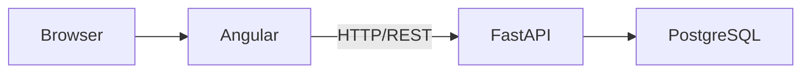
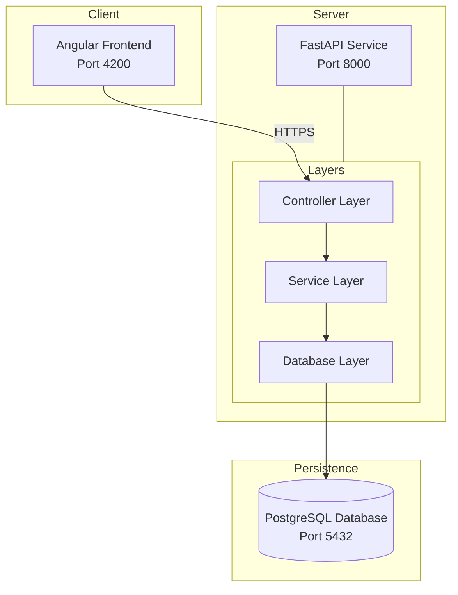

# Signal Desk

Signal Desk is a learning project for studying DevOps through a small communication platform.

The planned system contains:

- Angular frontend (`signal-interface`)
- FastAPI backend (`message-service`)
- PostgreSQL database
- Docker for packaging and local environments
- Kubernetes for orchestration
- GitHub Actions for CI/CD

This repository currently contains the study material. The application can be built incrementally as each milestone is completed.

## Study guide

Read [the DevOps study guide](docs/devops-study-guide.md) for the learning path, minimal examples, exercises, and checkpoints.

## Monorepo Structure

```
signal-desk/
├── web/                 # Angular web interface
│   ├── src/
│   │   ├── app/
│   │   │   ├── components/      # Reusable UI components
│   │   │   ├── services/        # API communication services
│   │   │   └── app.component.ts # Root component
│   │   ├── main.ts
│   │   └── index.html
│   ├── angular.json
│   └── package.json
├── messages/            # FastAPI message service
│   ├── src/             # Source code
│   │   ├── main.py       # FastAPI application entry
│   │   ├── database/     # Database infrastructure, models & sessions
│   │   └── messages/     # Message-specific business logic
│   │       ├── main.py    # API Controllers (Routers)
│   │       ├── service.py # Business Logic & Database transactions
│   │       └── schemas.py  # Pydantic models
│   ├── migrations/      # Alembic schema versions
│   ├── pyproject.toml   # Project dependencies & configuration
│   └── Dockerfile       # Containerization
└── docs/               # Documentation
```

## Current scope (v0)

The first communication path is a synchronous REST request:



### v0 Implementation

**Web Interface** (`/web`):
- Angular 17 frontend with standalone components
- DaisyUI component library
- Message button in header that opens a modal for composing messages
- Message list displaying all messages with timestamps
- HTTP client communicating with Message Service

**Message Service** (`/messages`):
- FastAPI REST API with endpoints:
  - `POST /api/messages` - Create a new message
  - `GET /api/messages` - Retrieve all messages
  - `GET /health` - Health check
- **Service-Oriented Architecture**: Separation of controllers (HTTP logic) and services (DB transactions).
- **Centralized Database Package**: Shared models and session management.
- PostgreSQL database persistence.
- CORS middleware for web interface communication.
- Alembic for schema versioning and migrations.

Later milestones can add asynchronous messaging and streaming after the REST path is understood.

## Getting Started

### Prerequisites

- Node.js 18+ and npm (for web interface)
- Python 3.10+ and pip (for message service)
- PostgreSQL 12+ (local or Docker)

### Quick Start with Docker Compose

```bash
# Create .env file for message service
cp messages/.env.example messages/.env

# Start PostgreSQL
docker-compose up -d postgres

# Wait for PostgreSQL to be ready (10-15 seconds)
sleep 15
```

### Running the Message Service

```bash
cd messages

# Create virtual environment
python -m venv venv

# Activate virtual environment
# On Windows:
venv\Scripts\activate
# On macOS/Linux:
source venv/bin/activate

# Install dependencies
pip install -r requirements.txt

# Run the service
python src/main.py
```

The service will start on `http://localhost:8000` with API docs at `http://localhost:8000/docs`

### Running the Web Interface

```bash
cd web

# Install dependencies
npm install

# Start development server
npm start
```

The web interface will be available at `http://localhost:4200`

## Architecture Diagram


