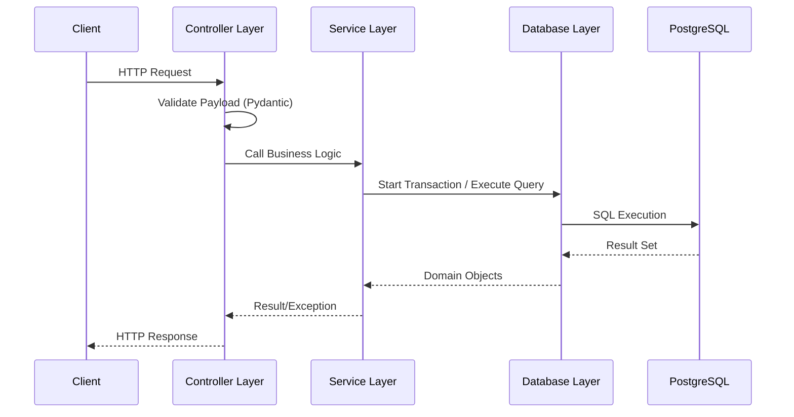

# Message Service

The Message Service is a FastAPI-based backend responsible for the creation, storage, and retrieval of messages within the Signal Desk platform.

## Architecture

The service follows a layered architecture to ensure separation of concerns:



- **Controller Layer** (`/src/messages/main.py`): Handles HTTP requests, request validation via Pydantic, and maps service results to API responses.
- **Service Layer** (`/src/messages/service.py`): Contains the business logic and manages database transactions.
- **Database Layer** (`/src/database/`): Centralizes SQLAlchemy models, session management, and database configuration.

## API Endpoints

| Method | Endpoint | Description | Response |
| :--- | :--- | :--- | :--- |
| `POST` | `/api/messages` | Creates a new message | `201 Created` |
| `GET` | `/api/messages` | Retrieves all messages | `200 OK` |
| `GET` | `/health` | Service health check | `200 OK` |
| `GET` | `/ready` | Database connectivity check | `200 OK` |

## Database Schema

The service uses PostgreSQL. The primary table is `messages`:
- `id` (Integer, PK): Unique identifier.
- `text` (String): The content of the message (1-5000 chars, non-blank).
- `created_at` (DateTime): Timestamp of creation.
- `status` (String): Current state of the message (e.g., "sent").

## Development

### Setup
1. Create a virtual environment: `python -m venv venv`
2. Activate environment: `source venv/bin/activate` (Linux/macOS)
3. Install dependencies: `pip install -r requirements.txt` or `uv sync`

### Running the Service
```bash
PYTHONPATH=src python src/main.py
```

### Database Migrations
Schema changes are managed via Alembic.
- **Check current version**: `alembic current`
- **Generate migration**: `alembic revision --autogenerate -m "description"`
- **Apply migrations**: `alembic upgrade head`

### Testing
```bash
PYTHONPATH=src pytest tests
```
